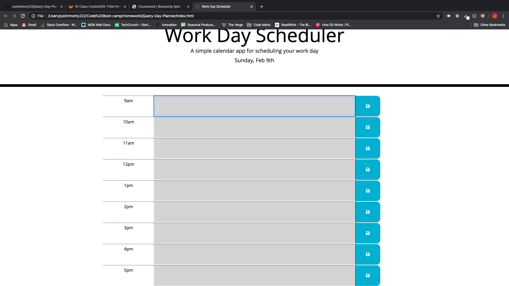

1. We were asked to dynamically updated the HTML and CSS of a day planner app using jQuery.

2. When the hour passes the color of the input field will change colors. Red for right now. Green for the future & grey for the past. 

3. When the user clicks on the save button whatever text they had in the input field would be saved to local storage.

4. When they open up the page again whatever they typed into the input will appear where it was saved. 

https://justinmonty20.github.io/jQuery-Day-Planner/.

